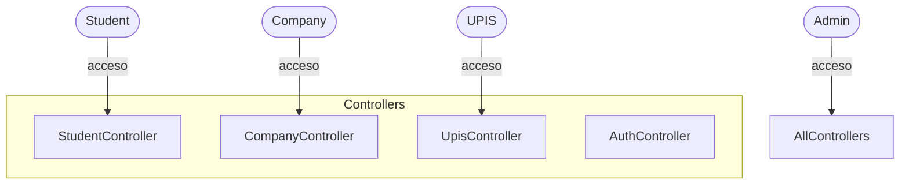

# SIEP — Sistema Integral de Estancias Profesionales (README definitivo)

Última actualización: 2025-10-23  
Autor: Equipo SIEP / CaldoTWC

Resumen corto
-------------
SIEP — Sistema Integral de Estancias Profesionales  
Gestión completa de cartas (presentación, aceptación, validación), acreditaciones, vacantes y seguimiento entre estudiantes, empresas y la UPIS.

Badges (sugeridos)
- Lenguaje: PHP
- Estado: WIP / En desarrollo
- Licencia: (añadir si aplica)

Logo
----
(inserta imagen/logo en `public/assets/logo.png` si aplica)

Índice
------
1. Encabezado general  
2. Descripción general del proyecto  
3. Arquitectura y estructura del proyecto (incluye diagrama)  
4. Requisitos e instalación (incluye `.env` de ejemplo)  
5. Estructura de carpetas  
6. Autenticación y roles (diagrama)  
7. Flujos principales (documentados paso a paso, con archivos y métodos)  
8. Base de datos (tablas principales, ER y queries)  
9. Generación de documentos (PDFs)  
10. Notificaciones y correos  
11. Seguridad  
12. Migraciones y actualizaciones  
13. Pruebas y validación  
14. Troubleshooting (errores comunes)  
15. Mantenimiento y mejoras futuras  
16. Créditos y licencia  
17. Anexo técnico canónico (referencias rápidas de archivos y métodos)

---

1. Encabezado general
---------------------
Nombre del proyecto:
SIEP — Sistema Integral de Estancias Profesionales

Descripción corta:
Plataforma para gestionar la recepción y seguimiento de estancias profesionales: solicitudes de cartas, aceptación por empresas, constancias de validación, acreditaciones y reportes para UPIS.

Propósito:
Automatizar y centralizar los procesos entre estudiantes, empresas y UPIS para reducir papeleo, mejorar trazabilidad y acelerar revisiones.

Público objetivo:
- Estudiantes (envío de documentación, solicitudes)
- Empresas (ofertas, cartas de aceptación/validación)
- Personal UPIS (revisiones, aprobaciones, reportes)
- Administradores

---

2. Descripción general del proyecto
-----------------------------------
Contexto:
La UPIS necesita un sistema para gestionar las estancias profesionales: solicitudes, validación de horas, cartas formales y registro histórico.

Objetivo principal:
Facilitar el flujo documental y la comunicación entre estudiantes, empresas y UPIS, preservando evidencia y generando documentos oficiales (PDF) y reportes.

Módulos principales:
- Autenticación / perfiles (students, companies, upis, admin)
- Gestión de vacantes (companies)
- Solicitudes de cartas de presentación (students → UPIS)
- Generación de cartas de aceptación y validación (companies)
- Acreditaciones: subida de documentos por estudiantes y revisión por UPIS
- Reportes y registro histórico (completed processes)

Beneficios:
- Centralización de información
- Menor tiempo de tramitación
- Registro auditable de procesos

---

3. Arquitectura y estructura del proyecto
----------------------------------------
Tipo:
Monolito PHP estilo MVC (controladores, modelos y vistas separados dentro de `/src`).

Capas:
- Controladores: `/src/Controllers` — orquestan flujos.
- Modelos: `/src/Models` — acceso a BD (PDO).
- Vistas: `/src/Views` — HTML/PHP.
- Librerías helpers: `/src/Lib` — DocumentGenerator, Session, FileHelper, Mailer.
- Entrada: `public/index.php` — front controller (router por action).

Dependencias principales:
- PHP >= 7.4 (recomendado 8.0+)
- Extensiones: pdo_mysql, fileinfo, mbstring, json
- Librería PDF: FPDF / FPDI (incluir en repo o en vendor)

Diagrama (Mermaid)


Explicación:
- El Front Controller despacha a controladores según `action`.
- Los controladores usan modelos para DB (via PDO) y libs para PDF/correo/archivos.
- Los PDFs se generan en libs y se envían al navegador (inline/descarga).

---

4. Requisitos e instalación
---------------------------
Requisitos técnicos:
- PHP 7.4+ (8.0/8.1 recomendado)
- MySQL / MariaDB 5.7+ / 10.x
- Extensiones PHP: pdo_mysql, fileinfo, mbstring, json, openssl (para SMTP futuro)
- Web server: Apache o Nginx

Dependencias de PDFs:
- FPDF (o FPDI si usas plantillas)
  - Añadir la librería en `src/Lib/vendor/` o incluir con composer si el servidor lo permite.

Instalación paso a paso (local):
1. Clonar repo
```bash
git clone https://github.com/CaldoTWC/SIEP.git
cd SIEP
git checkout feature/env-accreditation-notifications  # rama actual con mejoras
```
2. Crear `.env` (ver ejemplo más abajo) y configurar DB/SMTP.
3. Crear BD e importar dump (o ejecutar migraciones)
```bash
mysql -u root -p -e "CREATE DATABASE siep CHARACTER SET utf8mb4 COLLATE utf8mb4_general_ci;"
mysql -u root -p siep < path/to/siep_dump.sql
# Ejecutar migración añadida:
mysql -u root -p siep < sql/migrations/2025-10-22-add-accreditation-metadata.sql
```
4. Ajustar permisos:
```bash
mkdir -p public/uploads/accreditation
chmod -R 775 public/uploads
```
5. Configurar VirtualHost (Apache) o server block (Nginx) apuntando a `public/`.
6. Abrir en navegador: http://localhost/SIEP/public/ (o la URL configurada)

Ejemplo `.env` completo
```
DB_HOST=localhost
DB_NAME=siep
DB_USER=root
DB_PASS=
DB_CHARSET=utf8mb4

SITE_URL=http://localhost/SIEP/public

# SMTP opcional (para PHPMailer o integración futura)
SMTP_HOST=smtp.example.com
SMTP_PORT=587
SMTP_USER=user@example.com
SMTP_PASS=supersecret
SMTP_FROM="SIEP <no-reply@example.com>"
```
- Copia `.env.example` a `.env` y modifica valores. No subir `.env` al repo.

---

5. Estructura de carpetas
-------------------------
Árbol simplificado:
```
/public
  index.php            # Front controller
  uploads/             # archivos subidos (accreditation, others)
  css/ js/ assets/
 /src
  /Config
    Database.php
    env.php
  /Controllers
    AuthController.php
    StudentController.php
    CompanyController.php
    UpisController.php
  /Models
    User.php
    Accreditation.php
    CompanyStudentLink.php
    DocumentApplication.php
    CompletedProcess.php
  /Views
    /student
      accreditation_form.php
      dashboard.php
    /company
      acceptance_letter_form.php
      validation_letter_form.php
    /upis
      review_letters.php
  /Lib
    Session.php
    FileHelper.php
    DocumentGenerator.php
    Mailer.php
/sql
  migrations/*.sql
README.md
```

Breve descripción por carpeta:
- `/public`: entrada y recursos públicos.
- `/src/Controllers`: lógica de rutas y procesos.
- `/src/Models`: interacciones DB.
- `/src/Views`: plantillas y formularios.
- `/src/Lib`: utilidades (PDF, correo, sesión).
- `/sql`: migraciones y dumps.

---

6. Autenticación y roles
------------------------
Roles:
- `student` — estudiantes
- `company` — empresas
- `upis` — personal académico/UPIS
- `admin` — administrador

Flujo de autenticación:
- Login: `src/Controllers/AuthController.php::login()` → llama `src/Models/User.php::login()`  
  - `User::login()` realiza SELECT en `users`, verifica `password_verify()`, actualiza `last_login_at` y retorna datos.
- Sesiones: `src/Lib/Session.php::setUser()` guarda `$_SESSION['user_id']` y `$_SESSION['user_role']`.
- Protect: `Session::guard(['role1','role2'])` se llama en controladores para proteger rutas.

Diagrama Mermaid (roles y accesos)


---

7. Flujos principales (detalle exhaustivo)
-----------------------------------------
Para cada flujo incluyo: actor, vista, controlador, modelo, validaciones, resultado y diagrama secuencial.

A. Solicitud de carta de presentación (Student → UPIS)
- Actor: Estudiante
- Vista: `src/Views/student/request_presentation_letter.php`
- Controlador: `src/Controllers/StudentController.php`
  - `showDetailedLetterForm()` — muestra el form prellenado con `User::getStudentProfileForForm()`
  - `submitDetailedLetterRequest()` — procesa POST y llama `DocumentApplication::create($data)`
- Modelo: `src/Models/DocumentApplication.php::create($data)`
  - Inserta en `document_applications` con `application_type='presentation_letter'`
- Validaciones:
  - Campos obligatorios (boleta, semester, transcript file)
  - Archivos: PDF via finfo
- Resultado:
  - Nuevo registro en `document_applications` con `status='pending'`
  - UPIS recibe la solicitud en su panel: `UpisController::reviewLetters()`
- Diagrama secuencial (simplificado):
  - Student → StudentController::submitDetailedLetterRequest() → DocumentApplication::create() → DB → UPIS UI

B. Generación de carta de aceptación (Company acepta Student)
- Actor: Empresa (empresa registrada y con sesión activa)
- Vista: `src/Views/company/acceptance_letter_form.php`
- Controlador: `src/Controllers/CompanyController.php::generateAcceptanceLetter()`
  - Pasos (exactos y ordenados):
    1. Guard route: `session->guard(['company'])`
    2. Validar POST y `student_boleta`
    3. Buscar `student_id`:
       - `User::findStudentIdByBoleta($boleta)` (src/Models/User.php)
    4. Obtener student profile:
       - `User::getStudentProfileForForm($student_id)` (debe retornar `full_name`, `career`)
    5. Obtener company profile id:
       - `CompanyController::getCompanyProfileId($_SESSION['user_id'])` → SELECT id FROM company_profiles WHERE contact_person_user_id = :user_id
    6. Obtener datos empresa:
       - `User::getCompanyProfileByUserId($_SESSION['user_id'])`
    7. Crear vínculo empresa-estudiante:
       - `CompanyStudentLink::existsActiveLink(company_profile_id, student_id)` (evitar duplicados)
       - Setear props:
         - `$linkModel->company_profile_id = $company_profile_id;`
         - `$linkModel->student_user_id = $student_id;`
         - `$linkModel->acceptance_date = date('Y-m-d');`
       - `$linkModel->create()` → INSERT INTO `company_student_links`
    8. Preparar datos para PDF y llamar:
       - `DocumentGenerator::generateAcceptanceLetter($student_data_for_pdf, $company_data_for_pdf)`
- Validaciones:
  - Boleta existe, company_profile_id no nulo, vínculo no duplicado
- Resultado:
  - PDF de Carta de Aceptación mostrado al navegador
  - Registro en `company_student_links` con status='active'
- Archivos y métodos exactos involucrados (resumen):
  - Vista: `src/Views/company/acceptance_letter_form.php`
  - Controller: `src/Controllers/CompanyController.php::generateAcceptanceLetter()`
  - Model: `src/Models/User.php::findStudentIdByBoleta()` and `getStudentProfileForForm()`; `src/Models/CompanyStudentLink.php::create()`/`existsActiveLink()`
  - PDF: `src/Lib/DocumentGenerator.php::generateAcceptanceLetter()`

C. Generación de constancia de validación (Company)
- Actor: Empresa
- Vista: `src/Views/company/validation_letter_form.php`
- Controlador: `src/Controllers/CompanyController.php::generateValidationLetter()`
  - Llama `User::getCompanyProfileByUserId()` para datos empresa
  - `DocumentGenerator::generateValidationLetter($validation_data, $company_data)`
- Resultado: PDF emitido al navegador

D. Subida de acreditación (Student → UPIS)
- Actor: Estudiante
- Vista: `src/Views/student/accreditation_form.php` (form completo, actualizado)
- Controlador: `src/Controllers/StudentController.php::submitAccreditation()`
  - Validaciones:
    - `session->guard(['student'])`
    - `privacy_accept` obligatorio
    - Archivos obligatorios: `final_report`, `validation_letter`
    - Si `company_registered == no`: `payroll_receipts[]` (múltiples permitidos)
    - MIME via `finfo` → `application/pdf`
    - Tamaño máximo por archivo: 5 MB (configurable)
  - Pasos:
    1. Mover archivos con `move_uploaded_file` a carpeta: `public/uploads/accreditation/{boleta}/`
       - Utiliza `FileHelper::getStudentSubfolder()`
    2. Construir `metadata` (JSON) con todos los campos del formulario y rutas de archivos
    3. Llamar `Accreditation::createSubmission($student_id, $final_report_path, $validation_letter_path, $metadata_json)`
       - Inserta en `accreditation_submissions` con `status='pending'`
    4. Enviar correo de confirmación al estudiante: `mailer_send(...)`
    5. Enviar correo a todos los usuarios `role='upis'` activos informando nueva entrega
- Modelo:
  - `src/Models/Accreditation.php::createSubmission()`, `getSubmissionById()`, `deleteSubmission()`, `getPendingAccreditations()`
- Resultado:
  - Fila en `accreditation_submissions` (pending)
  - UPIS notified by email

E. UPIS procesa y completa acreditación
- Actor: UPIS
- Controlador: `src/Controllers/UpisController.php::completeAccreditation()`
  - Pasos:
    1. `Accreditation::getSubmissionById($id)` → obtener metadata + student info
    2. `DocumentApplication::getRequestDateByStudentId(student_id)` → fecha de solicitud (si aplica)
    3. `CompletedProcess::create(student_user_id, student_full_name, boleta, letter_date)` → registro histórico
    4. `Accreditation::deleteSubmission($id)` (o `markAsCompleted($id)`)
    5. Enviar correo al estudiante (mailer_send) confirmando acreditación completada
- Resultado:
  - Registro en `completed_processes`
  - Eliminación/actualización de la submission pendiente

---

8. Base de datos
----------------
Tablas principales y campos relevantes (extracto)

- users
  - id, email, password, first_name, last_name_p, last_name_m, phone_number, role (student|company|upis|admin), status (pending|active|inactive), created_at, last_login_at

- student_profiles
  - id, user_id (FK users.id), boleta (UNIQUE), career

- company_profiles
  - id, company_name, commercial_name, contact_person_user_id (FK users.id), contact_person_position, etc.

- company_student_links
  - id, company_profile_id (FK), student_user_id (FK), status (active|completed), acceptance_date, completion_date

- document_applications
  - id, student_user_id, application_type, status, credits_percentage, current_semester, transcript_path, target_company_name, created_at, reviewed_at

- accreditation_submissions
  - id, student_user_id, final_report_path, validation_letter_path, metadata (TEXT JSON), status (pending|completed), submitted_at

- completed_processes
  - id, student_user_id, student_name, student_boleta, presentation_letter_date, accreditation_completed_date, total_duration_days

Relaciones (resumen):
- users 1 - 1 student_profiles
- users 1 - 1 company_profiles (contact person)
- company_profiles 1 - * company_student_links
- users 1 - * accreditation_submissions
- completed_processes registra historiales por student_user_id

ER-diagrama (Mermaid)


Consultas útiles
- Listar acreditaciones pendientes:
```sql
SELECT ac.id, u.email, sp.boleta, ac.submitted_at
FROM accreditation_submissions ac
JOIN users u ON ac.student_user_id = u.id
JOIN student_profiles sp ON u.id = sp.user_id
WHERE ac.status='pending';
```

---

9. Generación de documentos (PDF)
---------------------------------
Librería:
- FPDF / FPDI (usar FPDI si se usan plantillas PDF)

Código:
- `src/Lib/DocumentGenerator.php` contiene:
  - `generatePresentationLetter(array $student_data, bool $returnAsString = false)`
  - `generateAcceptanceLetter(array $student_data, array $company_data)`
  - `generateValidationLetter(array $validation_data, array $company_data)`

Entrada / salida:
- Entrada: arrays con campos predefinidos (ej.: student_name, student_boleta, student_career, area, project_name, gender, company_name, contact_person_position)
- Salida: `$pdf->Output('I', 'Carta_Aceptacion_{boleta}.pdf', true)` — muestra en browser

Plantillas:
- Si se usa FPDI, incluir `templates/CP.pdf` o equivalente y posicionar texto sobre ella.

---

10. Notificaciones y correos
----------------------------
Implementación actual:
- `src/Lib/Mailer.php` — función `mailer_send($to, $subject, $html_body, $from=null)` que usa `mail()` como fallback y hace `error_log()` en fallos.

Eventos que disparan correos:
- Subida de acreditación por estudiante → Confirmación al estudiante + notificación por correo a todos `role='upis'` activos.
- UPIS completa acreditación → correo al estudiante.
- (Por implementar) Empresa aprobada/rechazada → correo al contacto de la empresa.
- Carta de aceptación generada → opcional: correo al estudiante.

Plantillas:
- No hay plantillas sofisticadas en esta PR; usar HTML sencillo en `mailer_send()`. Recomendado: almacenar plantillas en `src/Views/emails/` y renderizar.

Futuro:
- Integrar PHPMailer (SMTP), manejar colas/ retry y plantillas Twig/Blade para emails.

---

11. Seguridad
-------------
Puntos implementados y recomendados:
- Control de acceso: `Session::guard()` en cada controlador para roles.
- Validación de archivos:
  - `finfo_file()` para MIME
  - Tamaño máximo por archivo (5 MB)
- Protección de `.env`: no subir al repo
- Impedir ejecución en `public/uploads/` (config del servidor)
- Escape/escape output en vistas (usar `htmlspecialchars()` al imprimir datos)
- Preparar sentencias PDO (bindParam) en modelos para prevenir SQLi
- Rate-limiting y validación adicional si se expone públicamente

---

12. Migraciones y actualizaciones
---------------------------------
Migración añadida (ejecutar en BD)
- `sql/migrations/2025-10-22-add-accreditation-metadata.sql`  
  Añade columna `metadata` (TEXT) a `accreditation_submissions`.

Estrategia de branch:
- `main` / `master`: código estable
- `feature/*` para características nuevas (ej.: `feature/env-accreditation-notifications`)
- `hotfix/*` para correcciones críticas

Revertir migración:
- Hacer backup previo, luego `ALTER TABLE accreditation_submissions DROP COLUMN metadata;` si es necesario, tras análisis.

---

13. Pruebas y validación
------------------------
Manual (rápido)
- Usar la UI:
  - Registrar estudiante > Login > Ir a formulario de acreditación > Subir archivos válidos (PDF ≤ 5 MB)
  - Registrar empresa > Login > Generar carta de aceptación (usar boleta válida)
- Ver DB: confirmar registros en `accreditation_submissions`, `company_student_links`, `completed_processes`

Automatizado (recomendado)
- PHPUnit para modelos críticos (`User`, `Accreditation`, `CompanyStudentLink`)
- Tests de integración para rutas (simular POST multipart/form-data para subida)

Casos críticos:
- Subida de archivos inválidos (no PDF, >5MB)
- Boleta no encontrada en generación de carta de aceptación
- Duplicación de vínculo empresa-estudiante

---

14. Troubleshooting (Errores comunes)
-------------------------------------
A) Error de conexión a BD:
- Revisar `src/Config/Database.php` y `.env`
- Logs: Apache/PHP error_log y `error_log()` outputs

B) PDO vs MySQLi mismatch:
- Usar solo PDO. Si ves `bind_param()` en un archivo, reemplazar por `bindParam()` PDO.

C) Column cannot be null (company_profile_id):
- Revisar `getCompanyProfileId()` y asegúrate que retorna id entero antes de llamar `CompanyStudentLink::create()`.

D) Archivos no suben:
- Revisar `upload_max_filesize` y `post_max_size` en php.ini
- Revisar permisos de `public/uploads/`

E) PDF no se genera:
- Revisar `src/Lib/DocumentGenerator.php` ; verificar que la librería FPDF/FPDI está incluida y disponible.

---

15. Mantenimiento y mejoras futuras
-----------------------------------
Prioridades sugeridas:
1. Integrar PHPMailer y sistema SMTP confiable
2. Añadir persistencia de notificaciones (tabla `notifications`) y UI para bandeja interna
3. Pruebas unitarias y CI (GitHub Actions)
4. Implementar colas para procesamiento pesado (generación masiva de PDFs)
5. Mejorar UX del formulario (JS para mostrar/ocultar campos según `company_registered`)

---

16. Créditos y licencia
-----------------------
Autores:
- Equipo SIEP / CaldoTWC (lista de colaboradores en GitHub)

Licencia:
- (Añadir licencia: MIT / GPL / propietario según decisión)

---

17. Anexo técnico canónico
--------------------------
Referencia rápida por archivo (métodos principales):
- CompanyController::generateAcceptanceLetter() — `src/Controllers/CompanyController.php`
- CompanyStudentLink::create(), existsActiveLink() — `src/Models/CompanyStudentLink.php`
- DocumentGenerator::generateAcceptanceLetter() — `src/Lib/DocumentGenerator.php`
- StudentController::submitAccreditation() — `src/Controllers/StudentController.php`
- Accreditation::createSubmission(), getSubmissionById(), deleteSubmission() — `src/Models/Accreditation.php`
- UpisController::completeAccreditation() — `src/Controllers/UpisController.php`
- User::findStudentIdByBoleta(), getStudentProfileForForm(), getCompanyProfileByUserId() — `src/Models/User.php`
- Mailer: `src/Lib/Mailer.php` → `mailer_send()`

---

Si quieres que convierta esto en `README.md` del repo (push a `main`) o lo separe en varios documentos (README + README_TECHNICAL.md + MIGRATIONS.md), lo hago.  
También puedo generar:
- Diagrama PlantUML del ER y del flujo de carta de aceptación (archivo `.puml`) para renderizar imágenes fuera del repo.
- PR con los cambios finales y un checklist de QA para validar en staging.

¿Deseas que:
- empuje este README a la rama `feature/env-accreditation-notifications`? (o a `main`)
- genere los archivos PlantUML del ER y del flujo de carta de aceptación ahora?
```
```
